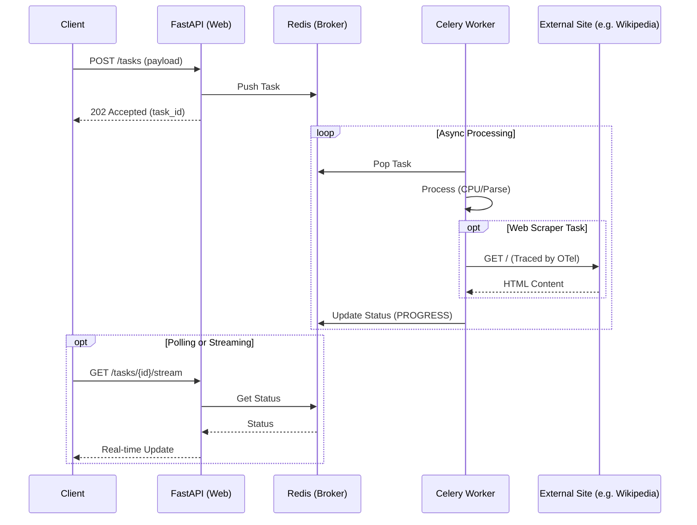

# Long Running API Demo & Technical Guide

A production-ready reference implementation and technical guide for handling long-running operations in FastAPI using Celery and Redis.

## 📚 Purpose

This repository serves two purposes:
1.  **Reference Implementation**: A working demo of the Async Task Queue pattern.
2.  **Technical Guide**: A resource for teams implementing long-running operations, covering architecture, sizing, and streaming patterns.

> [!IMPORTANT]
> **Database**: This demo uses **PostgreSQL** via Docker Compose to ensure production-grade concurrency and reliability.

## ⚠️ The Problem: Long-Running HTTP Requests

Many teams struggle with operations that take **20 minutes to 1 hour** (e.g., generating complex reports, training models, or processing large datasets).

**The Anti-Pattern**: Keeping the HTTP connection open while the server processes the request.

**Why this fails:**
1.  **Timeouts**: Load balancers (Azure App Gateway, AWS ALB, Nginx) typically have a hard timeout (e.g., 60s or 120s). Any request longer than this will result in a `504 Gateway Timeout`, even if the backend is still working.
2.  **Resource Exhaustion**: Each open connection consumes a thread or file descriptor on the web server. Thousands of long-running connections will starve the server, preventing it from handling new, quick requests.
3.  **Poor UX**: Users are left staring at a loading spinner with no feedback, and if the connection drops, they have no way to know the status.

**The Solution**: Decouple the **Request** from the **Processing** using the **Async Task Queue** pattern.

## 🏗️ Architecture: The Async Task Queue Pattern

For operations that take longer than a standard HTTP request timeout (e.g., > 30s), we **must** decouple the request from the processing.

### The Flow
1.  **Submit**: Client sends a `POST` request. Server immediately returns `202 Accepted` with a `task_id`.
2.  **Queue**: The task is pushed to a **Redis** queue.
3.  **Process**: A background **Celery Worker** picks up the task and executes it.
4.  **Monitor**: Client polls or streams status updates using the `task_id`.



## 📖 Technical Guides

Detailed documentation for specific architectural concerns:

| Guide | Description | Target Audience |
| :--- | :--- | :--- |
| **[Infrastructure Sizing (AKS)](docs/aks_sizing_guide.md)** | **CRITICAL**. How to size pods, node pools, and configure HPA/KEDA for Azure AKS. | Architects, DevOps |
| **[Real-Time Streaming (SSE)](docs/streaming_guide.md)** | Deep dive into Server-Sent Events for real-time progress updates. | Frontend/Backend Devs |
| **[Best Practices & Anti-Patterns](docs/best_practices.md)** | **MUST READ**. Claim Check pattern, idempotency, and common pitfalls. | Architects, Developers |
| **[Security Guidelines](docs/security_guidelines.md)** | **NEW**. Identity, Secrets, Network Security, and Vulnerability Scanning. | Security, DevOps |
| **[API Documentation](http://localhost:8001/docs)** | Swagger UI for the implementation endpoints. | Developers |

## 🚀 Quick Start

1.  **Prerequisites**: Docker & Docker Compose.
2.  **Run**: `docker-compose up -d --build` (Starts API, Worker, Redis, Postgres, and Jaeger)
3.  **Explore**:
    *   **UI**: [http://localhost:8001](http://localhost:8001) (Try the **Web Scraper** task!)
    *   **API Docs**: [http://localhost:8001/docs](http://localhost:8001/docs)
    *   **Jaeger (Tracing)**: [http://localhost:16686](http://localhost:16686) (View distributed traces for API -> Worker -> External)
    *   **Flower (Monitor)**: [http://localhost:5555](http://localhost:5555)

## 🌟 Features

*   **Async Task Queue**: Decoupled processing with Celery & Redis.
*   **Real-Time Updates**: Server-Sent Events (SSE) for live progress.
*   **Production DB**: PostgreSQL for durable job history and logs.
*   **Full Observability**: OpenTelemetry & Jaeger tracing (API, Worker, & External HTTP calls).
*   **Resiliency**: Retries, Circuit Breakers, and "At-Least-Once" delivery.
*   **Web Scraper**: Real-world demo task with external connectivity.

## 📂 Project Structure

```text
├── app/
│   ├── api/          # API Routes & Endpoints
│   ├── core/         # Config, DB, Celery Setup
│   ├── models/       # SQLAlchemy Models
│   ├── schemas/      # Pydantic Schemas
│   ├── worker/       # Celery Task Logic
│   └── main.py       # App Entrypoint
├── docs/             # Technical Guides
├── scripts/          # Utility Scripts (Verify, Test, Run)
│   ├── verify_scraper.py
│   └── run_dev.py
├── docker-compose.yml
└── run.py            # Prod Entrypoint
```
