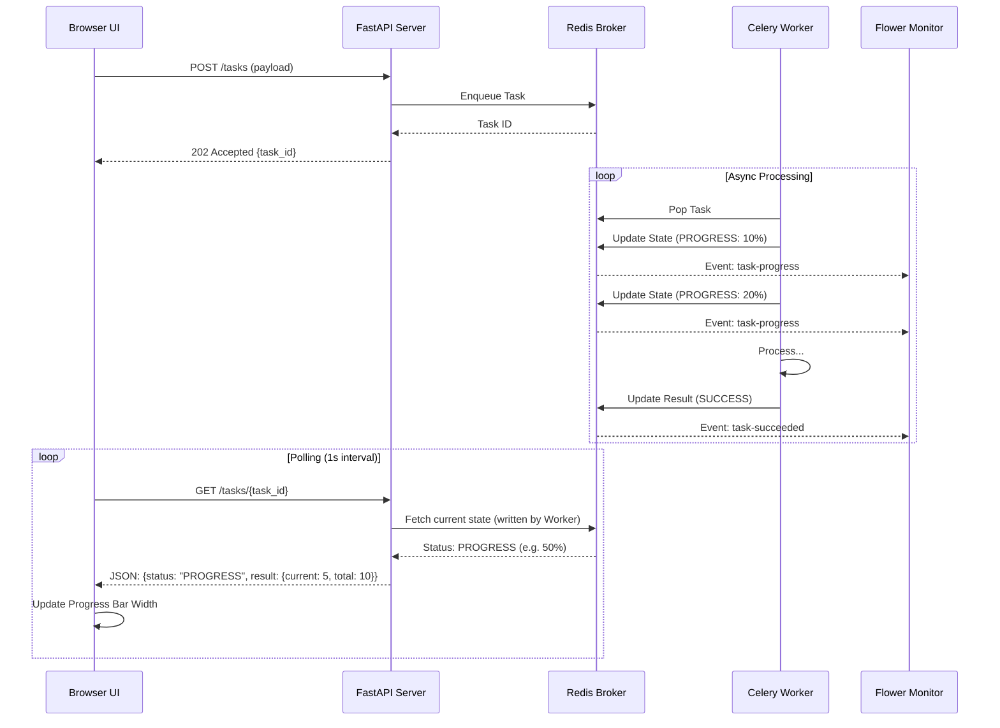

# Long Running Operations: Architecture & Best Practices

## 1. Architecture Guidelines

Handling long-running operations in a synchronous HTTP API (like a standard REST call) is an anti-pattern because it blocks the client, ties up server resources, and is prone to timeouts (e.g., standard 30-60s gateway timeouts).

The industry-standard solution is the **Asynchronous Task Queue Pattern**.

### The Pattern
1.  **Client** submits a request to the API.
2.  **API** validates the request, enqueues a message to a **Broker** (e.g., Redis, RabbitMQ), and immediately returns a `202 Accepted` response with a `task_id`.
3.  **Worker** (separate process) consumes the message from the Broker and executes the heavy computation.
4.  **Client** polls the API using the `task_id` to check status or receives a webhook callback when done.

### Diagram


## 2. New Features Implementation

### HTML Frontend
- **Location**: `app/static/index.html`
- **Features**:
  - Task submission with custom duration.
  - **Real-time Progress Bar**: Visualizes the `PROGRESS` state updates.
  - **Persistence**: Uses `localStorage` to save task history across reloads.
  - **Details View**: Inspect full JSON request/response payloads.

### Monitoring (Flower)
- **URL**: `http://localhost:5555`
- **Configuration**: Runs as a separate service in Docker.
- **Events**: Worker runs with `-E` flag to emit real-time events for Flower.

### Progress Streaming
- **Mechanism**: Celery `self.update_state(state='PROGRESS', meta={...})`.
- **Worker**: Emits progress events every second.
- **API**: Proxies the `PROGRESS` state and metadata to the client.

## 3. Best Practices

### Idempotency
- **Rule**: Ensure tasks can be retried without side effects.
- **Why**: Workers can crash or network issues can cause a task to be delivered twice.
- **Implementation**: Use unique keys for DB inserts (e.g., `upsert`), or check if a job was already done before starting.

### Retries & Backoff
- **Rule**: Configure automatic retries for transient failures (e.g., DB connection lost).
- **Implementation**: Celery supports `autoretry_for` with exponential backoff.
  ```python
  @celery.task(autoretry_for=(ConnectionError,), retry_backoff=True)
  def reliable_task(): ...
  ```

### Visibility Timeout
- **Rule**: Ensure the broker's visibility timeout is larger than the expected task duration.
- **Why**: If a task takes 5 minutes but timeout is 1 minute, the broker will think the worker died and redeliver the task to another worker, causing duplication.

### Monitoring
- **Rule**: You must monitor queue depth and worker health.
- **Tools**: Flower (for Celery), Prometheus/Grafana.

## 3. Constraints

### Message Size
- **Constraint**: Keep message payloads small (ideally < 1MB).
- **Reason**: Brokers like Redis/RabbitMQ are optimized for small messages. Large payloads clog the network and increase memory usage.
- **Solution**: Store large data (e.g., a 10MB CSV file) in Object Storage (S3/GCS) and pass only the **URL/Path** in the task message.

### Task Granularity
- **Constraint**: Avoid "God Tasks" that run for hours.
- **Reason**: Hard to restart, blocks worker for too long.
- **Solution**: Break down large jobs into smaller chunks (Chaining/Chord patterns).

## 4. Current Solution Implementation

We have implemented a **FastAPI + Celery + Redis** architecture.

### Components
- **FastAPI (`app/main.py`)**: 
  - Exposes `POST /tasks` to enqueue jobs.
  - Exposes `GET /tasks/{task_id}` for status checks.
  - Uses `celery.result.AsyncResult` to query Redis for state.
- **Celery Worker (`app/worker.py`)**: 
  - Defines the `process_vector_data` task.
  - Simulates work with `time.sleep`.
  - Returns a JSON result upon completion.
- **Redis**:
  - Runs in a Docker container.
  - Acts as both the **Broker** (queue) and **Result Backend** (storage for task status/return values).

### Flow
1. User sends vector data to `POST /tasks`.
2. App pushes data to Redis list `celery`.
3. App returns `task_id`.
4. Worker pops data, sleeps for 10s, returns result.
5. User polls `GET /tasks/{task_id}` and eventually sees `SUCCESS`.

## 5. API Documentation

### `POST /tasks`
Submit a new long-running operation.

**Request Body** (`application/json`):
```json
{
  "vector_data": [0.1, 0.2, 0.3],
  "metadata": {"source": "user"}
}
```

**Response** (`202 Accepted`):
```json
{
  "task_id": "c92f1a3b-...",
  "status": "Processing"
}
```

### `GET /tasks/{task_id}`
Check the status of a submitted task.

**Response** (`200 OK`):
```json
{
  "task_id": "c92f1a3b-...",
  "status": "SUCCESS",
  "result": {
    "processed_vectors": 3,
    "status": "indexed",
    "metadata_processed": {"source": "user"}
  }
}
```
