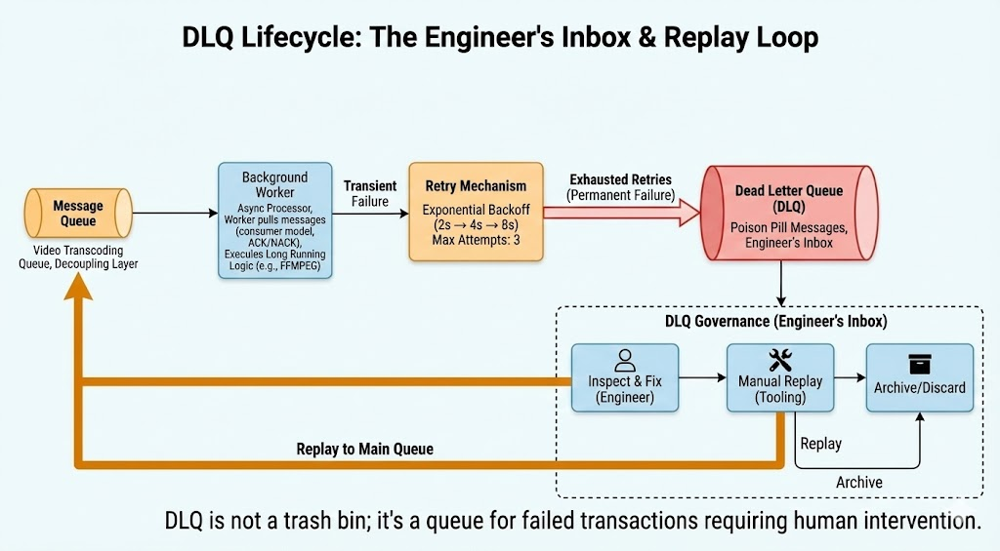

# Architectural Considerations for Long-Running API Workloads  
**By Naveen Garla Surendra — Lead Technical Architect**

## TL;DR
*   **The Constraint**: Synchronous HTTP imposes a strict "Chain of Timeouts" (Browser → LB → App) that limits operation duration.
*   **The Pattern**: Decouple the *Request* (Intent) from the *Process* (Execution) using the Async Worker pattern.
*   **The Trade-off**: Asynchronous systems introduce complexity (state management, eventual consistency) to buy reliability and scale.
*   **The Mandate**: Distributed workloads must be designed for "At-Least-Once" delivery, requiring strict idempotency.

---

## Introduction: The Fallacy of Synchronous Design

In distributed system architecture, few patterns are as deceptively simple as the synchronous Request-Response cycle. It is the default interaction model for the web: a client sends a request, and blocks until the server returns a result.

For transactional workloads—retrieving a user profile or updating a record—this model is efficient. However, it relies on a critical assumption: **that the duration of the work is negligible compared to the tolerance of the client.**

When this assumption is applied to long-running business processes—generating complex reports, ingesting bulk data, or performing AI inference—the architecture fragile.

### The Reactive Trap
A common operational anti-pattern is attempting to accommodate these workloads by extending timeout configurations. Teams often increase Load Balancer limits or proxy read timeouts in response to `504 Gateway Timeout` errors.

This is a **reactive** measure that introduces significant stability risks:
1.  **Resource Starvation**: Long-lived connections consume worker threads, reducing the system's capacity to handle concurrent traffic.
2.  **Failure Coupling**: The availability of the system becomes tightly coupled to the processing time of the slowest job.
3.  **Indeterminacy**: Network interruptions result in lost state, leaving the client unsure if the operation succeeded or failed.

### The Proactive Architect
As Lead Architects, our responsibility is to identify these "heavy" workloads during the design phase and decouple them from the synchronous path. We must move from an architecture that *attempts* to complete work inline to one that *schedules* work reliability.

This article outlines the architectural patterns required to bridge the gap between human expectation (responsiveness) and machine reality (processing latency), transforming fragile synchronous flows into robust asynchronous pipelines.

---

## 1. The Real-Time Illusion: Resolving the Expectation Gap

To design effective systems, we must first acknowledge the physical constraints of our infrastructure. The expectation of a linear `Request → Process → Response` flow is an abstraction that breaks down under load.

### The Enterprise Reality
Real-world enterprise workflows do not fit into the ~100ms budget of a standard interaction:
*   **Financial Reporting**: Aggregation of high-volume transaction data (Minutes).
*   **Data Ingestion**: Sanitization and loading of bulk datasets (Minutes to Hours).
*   **Generative AI**: Inference tasks on large language models (Seconds to Minutes).
*   **External Integrations**: Dependencies on legacy systems with variable latency (Indeterminate).

### The Architectural Shift
When we force these workloads into a synchronous model, we capture the user's browser in a hostage situation, forcing them to wait for a server processing loop. This creates a brittle dependency.

**The Solution**: We must shift our mental model from **Execution** to **Orchestration**.
*   **Synchronous**: "I will do this now and return the result."
*   **Asynchronous**: "I have accepted your request and will guarantee its execution."

This shift allows the API to remain responsive (returning in milliseconds) while the heavy lifting occurs in a decoupled, scalable environment. It transforms a potential timeout into a managed workflow.

> **Key Takeaway**: Synchronous architecture rewards speed of thought. Asynchronous architecture rewards clarity of design.

---

## 2. The Chain of Timeouts

A common query from engineering teams facing 504 errors is: *"Can we just increase the timeout configuration?"*

This question betrays a misunderstanding of how modern web infrastructure is layered. There is no single "timeout" switch. An API request traverses a **Chain of Timeouts**, and the connection will be terminated by the **weakest link** in that chain.

### The Hidden Infrastructure Layers
To successfully hold a connection open for 5 minutes, every single layer in the transit path must agree to the wait:

1.  **The User Agent (Browser)**: While Chrome/Edge ostensibly allow 5-minute timeouts, user patience typically expires within seconds, leading to page refreshes (and duplicate requests).
2.  **The Load Balancer (Cloud Edge)**:
    *   **Azure App Gateway V1**: Hard limit of **30 seconds**.
    *   **AWS ALB**: Defaults to 60 seconds.
3.  **The Ingress Controller (Cluster Edge)**:
    *   **Nginx**: Defaults to 60 seconds (`proxy_read_timeout`).
4.  **The Application Server (Compute)**:
    *   **Gunicorn/Uvicorn**: Worker processes have short timeouts (often 30s) to prevent "zombie" processes from leaking memory.

### The "Works on Local" Trap
This layering explains the most common debugging frustration: *Why does it work on my machine but fail in UAT?*

In a local development environment, the developer hits `localhost:8000` directly, bypassing the Load Balancer and Ingress. They might configure their local Uvicorn to wait 10 minutes, observing success. When deployed to a staging environment behind an Ingress Controller, the request is severed at 60 seconds, regardless of the application config.

### The Security Implication: DDoS by Design
Even if one *could* align configurations across all four layers—a significant challenge in Infrastructure-as-Code governance—doing so creates a severe vulnerability.

Web servers have a finite number of worker threads (e.g., `2 * CPU_Cores`). If an API allows 10-minute connections, a malicious actor (or a retry storm) needs only a small number of open connections to exhaust the thread pool. The server becomes unresponsive to *all* traffic, effectively self-inflicting a Denial of Service.

> **Key Takeaway**: Timeouts are an architectural constraint, not a configuration detail. We must design *around* them, not *through* them.

---

## 3. The Async Worker Pattern

To solve the timeout problem, we must fundamentally alter the contract between Client and Server. We move from a synchronous **Blocking** model to an asynchronous **Polling** (or Streaming) model. This is industry-standard "Async Worker Pattern."

### Decoupling Intent from Execution
In this architecture, the API endpoint no longer performs the heavy lifting. Its role shifts from **Worker** to **Dispatcher**.

1.  **Request**: The Client submits a payload (e.g., `POST /reports`).
2.  **Ack**: The API validates the request, pushes a task to a **Message Broker**, and immediately returns `202 Accepted` with a `job_id`.
3.  **Process**: A separate **Worker Service**, decoupled from the HTTP layer, consumes the message and executes the logic.
4.  **Result**: The Worker writes the final state to a persistent **Data Store**.


*Figure 1 — Example Async Request-Reply Architecture: The diagram illustrates one possible long-running workload (video transcoding) using an async job queue, background workers, durable job metadata, and a client status polling API. The same pattern applies to any long-running process such as report generation, ETL, AI inference, or bulk uploads.*

### The "Shock Absorber" Effect
Beyond solving timeouts, this pattern introduces a critical resilience trait: **Backpressure**.

In a synchronous system, traffic spikes translate directly to resource exhaustion. If 1,000 users click "Generate Report" simultaneously, the server attempts to spawn 1,000 threads, running out of RAM and crashing.

In an asynchronous system, the **Message Broker** acts as a shock absorber. It queues the 1,000 requests instantly. The Worker pool then processes them at a controlled rate (e.g., 5 at a time). The system remains stable and responsive, converting a dangerous **Traffic Spike** into a manageable **Processing Stream**.

> **Key Takeaway**: The Message Broker protects your compute resources from your users.

---

## 4. Message Broker Selection: A Strategic Decision

Selecting the "buffer" (Broker) is not just an infrastructure choice of "what do we have installed?"; it is an architectural decision about **Reliability Guarantees** versus **Operational Complexity**.

Not all queues are created equal. The Lead Architect must map the business requirement to the correct broker tier.

| Broker Tier | Technology Candidates | Best For | The Trade-off |
| :--- | :--- | :--- | :--- |
| **Tier 1: Lightweight** | **Redis**, **Azure Queue Storage**, **AWS SQS** | High-throughput, simple "Fire & Forget" tasks, or simple background jobs. | Limited routing capabilities. Redis requires AOF persistence for durability. |
| **Tier 2: Enterprise** | **RabbitMQ**, **Azure Service Bus**, **ActiveMQ** | Complex workflows requiring "Fan-out" (Pub/Sub), FIFO ordering, or strict Dead Letter Queue (DLQ) governance. | Higher operational overhead (deployment/management) or cost. |
| **Tier 3: Streaming** | **Kafka**, **Azure Event Hubs**, **Kinesis** | Massive scale telemetry, Event Sourcing, or Analytics pipelines. | **Overkill** for task queues. Complexity in consumer offset management. |

### The "Start Simple" Heuristic
A common anti-pattern is "Resume Driven Development"—choosing Kafka for a simple email worker.

**Recommendation**:
1.  **Start with Tier 1** (Redis/SQS) for speed and simplicity.
2.  **Graduate to Tier 2** (Service Bus/RabbitMQ) only when the business requires advanced governance (e.g., granular DLQ replay, message expiry policies).
3.  **Avoid Tier 3** (Kafka) for job processing unless you are building an Event Sourcing platform.

> **Key Takeaway**: Do not buy a Ferrari to tow a trailer. Match the broker complexity to the workload criticality.

---

## 5. Failure Handling: The Only Guarantee

In distributed systems, failure is not an anomaly; it is a probability. The mark of a sophisticated architecture is not preventing failure, but categorizing it.

We must distinguish between two distinct failure archetypes:

### 1. Transient Failures (The "Hiccup")
These are temporary disruptions: a database failover, a network timeout, or a rate limit (`429 Too Many Requests`).
*   **Strategy**: **Retry with Exponential Backoff**.
*   **Mechanism**: Wait 2s, then 4s, then 8s. Cap the attempts (e.g., 3 retries).
*   **Outcome**: The system self-heals without human intervention.

### 2. Permanent Failures (The "Poison Pill")
These are logical errors: a schema violation, a missing file, or a `400 Bad Request` from an external API.
*   **Strategy**: **Fail Fast and Quarantine**.
*   **Mechanism**: Do *not* retry. Move the message immediately to a **Dead Letter Queue (DLQ)**.
*   **Outcome**: Resources are preserved. The failure is isolated for inspection.

*Figure 2 — Example DLQ Lifecycle (Retry → Failure → DLQ → Replay)*

### The DLQ Governance Mandate
A common operational failure is treating the DLQ as a "Trash Bin" where messages go to die. As an architect, you must enforce the rule: **The DLQ is an Engineer's Inbox.**

Every message in the DLQ represents a failed business transaction. You must build tooling (or use Azure Service Bus Explorer) to:
1.  **Inspect** the payload.
2.  **Fix** the underlying bug.
3.  **Replay** the message back into the main queue.

> **Key Takeaway**: Resilience requires distinguishing between "Try Again Later" (Transient) and "Human Intervention Needed" (Permanent).

---

## 6. Idempotency: The Survival Mechanism

A defining characteristic of distributed messaging is the "Two Generals' Problem": it is mathematically impossible to guarantee **Exactly-Once** delivery. We must build our systems assuming **At-Least-Once** delivery.

This means your Worker Service **will** eventually receive the same message twice. This can occur if a worker crashes after processing but before sending the acknowledgement (ACK) to the broker.

### The Architectural Guardrail
To prevent duplicate side effects (e.g., charging a customer twice), every processor must be **idempotent**.

**Pattern**:
1.  **Idempotency Key**: Every job includes a unique UUID (e.g., `Correlation-ID`).
2.  **State Check**: The worker checks a distributed lock (Redis) or the persistence layer before execution.

```python
# Conceptual Idempotency Logic
def process_payment(transaction_id):
    if lock_store.exists(transaction_id):
        return  # No-op: Already handled
    
    # ... Execute Critical Logic ...
    
    lock_store.set(transaction_id, "COMPLETED")
```

> **Key Takeaway**: Idempotency is not an optional feature; it is a correctness requirement for async systems.

---

## 7. Auto-Scaling with KEDA

The final piece of the puzzle is elasticity. How do we scale our workers?

Traditional autoscaling (HPA) relies on CPU or Memory metrics. This fails for async workers. A worker waiting on a slow I/O operation (e.g., generating a PDF) might use 0% CPU while being 100% busy.

### The Supply and Demand Model
We must scale based on **Supply** (Queue Depth) and **Demand** (Worker Capacity).

**KEDA (Kubernetes Event-driven Autoscaling)** bridges this gap. It acts as a metric server that tells Kubernetes: *"There are 5,000 items in the Redis list; please spawn 50 pods immediately."*

*   **Lag > Target**: Scale Out.
*   **Lag = 0**: Scale In (potentially to zero).

```
[DIAGRAM PLACEHOLDER — KEDA Autoscaling Based on Queue Depth]
```

This ensures cost-efficiency: you pay for compute only when there is work in the queue, rather than provisioning for peak load 24/7.

---

## 8. Security Considerations for Async Job Systems

Async systems introduce unique attack vectors that standard API security scanning often misses.

*   **Opaque Identifiers**: Never return sequential integers (e.g., `job_id: 104`) to the client. This allows competitors to estimate your transaction volume. Always use UUIDs.
*   **Replay Authorization**: The ability to "Replay from DLQ" is a powerful tool that effectively modifies state. This action must be restricted to **Admin** roles only (RBAC) to prevent unauthorized data mutation.
*   **Internal Hygiene**: Queue names and connection strings are internal implementation details. Never expose them in HTTP headers or error messages.
*   **Credential Isolation**: Segregate worker permissions. The API should have `Write` access to the Queue, but the Worker needs `Listen/Consume` access.

---

## 9. Case Study: "NimbusPay" Modernization

> **Context**: NimbusPay (a fictional internal billing platform) provided a "Monthly Reconciliation" feature for enterprise clients.
>
> **The Problem**: The reconciliation process took 5–7 minutes to aggregate transaction logs. The team attempted to mitigate timeouts by increasing Nginx limits to 600s. However, during end-of-month spikes, the platform suffered cascading failures due to connection thread exhaustion. Error rates topped 18%.
>
> **The Solution**: The team refactored to an **Async Command Pattern** using Azure Service Bus.
> *   The API was changed to return `202 Accepted` immediately.
> *   Jobs were offloaded to a dedicated worker pool scaling via KEDA.
> *   A strict DLQ policy was implemented for data validation errors.
>
> **The Result**: 504 errors were eliminated (<1%). Customer support tickets regarding "frozen screens" dropped to near zero. The system now processes 10x the concurrent volume with the same compute footprint.

---

## 10. Anti-Patterns: What NEVER To Do

1.  **Polling loops on the Database**: Never have a client poll your primary database every 500ms. Use caching or push mechanisms (SSE/WebSockets).
2.  **Broker as a Database**: Message Brokers are for *transit*, not *storage*. Do not rely on them for long-term audit history.
3.  **Infinite Retries**: Always cap retries. An infinite retry loop on a "Poison Pill" message will clog your DLQ and mask other failures.
4.  **Mixed Workloads**: Do not host heavy background workers in the same process/container as your lightweight API. CPU contention will degrade API latency.

---

## 11. Final Production Checklist

Before certifying an async architecture for production, ensure you can answer "Yes" to the following:

*   [ ] **State**: Do we persist job metadata in a Database (Postgres/Cosmos), independent of the Queue?
*   [ ] **Safety**: Is Idempotency enforced on the worker side to prevent duplicate side effects?
*   [ ] **Resilience**: Do we explicitly distinguish between Transient (Retry) and Permanent (DLQ) failures?
*   [ ] **Operations**: Do we have tooling to inspect and safely replay DLQ messages?
*   [ ] **Scale**: Is autoscaling triggered by **Queue Depth** (Lag) rather than CPU?
*   [ ] **Visibility**: Do we have distributed tracing (Trace ID) linking the API request to the Worker execution?

If "No" appears anywhere on this list, the system is not ready for high-scale production.

---

## Conclusion

There is a defining moment in every architect's career where they realize:
> Systems don't fail because engineers are bad. Systems fail because **unpredictability is normal.**

The goal of a Lead Architect is not just to design happy paths, but to design systems that facilitate **safe recovery** when things inevitably go wrong. By moving from synchronous execution to asynchronous orchestration, you purchase the insurance policy your platform needs to survive success.

**Reader Question**: What is your team's strategy for handling "Poison Pill" messages in production? Share your patterns for DLQ governance in the comments.

